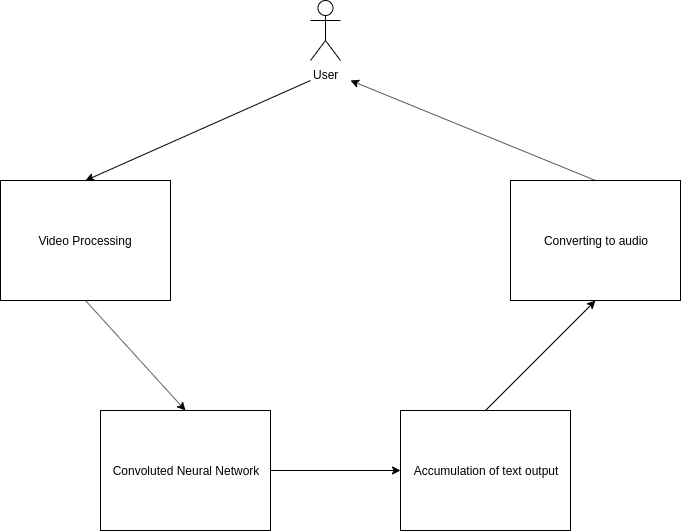
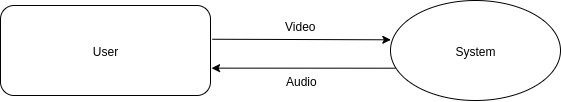
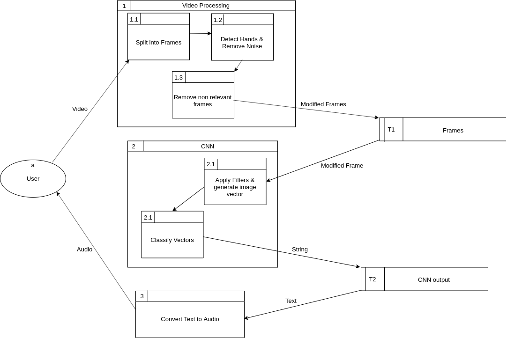
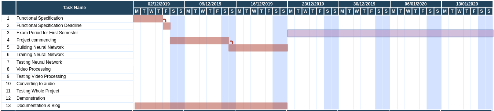
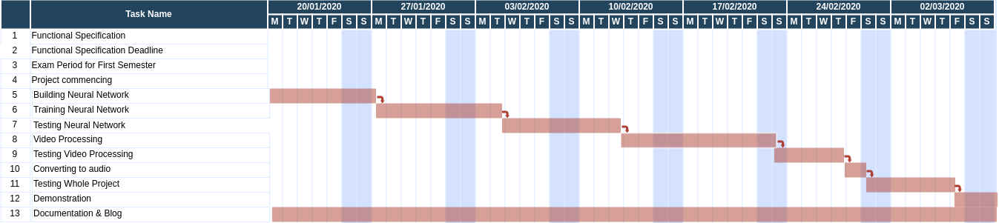

# **Functional Specification for Sign Language Translator**
# **CA326 Year 3 Functional Specification**

by Killian Connolly & William John O’Hanlon

06/12/2019

#### **Table of Contents**

Table of Contents    i

1. Introduction    4

1.1 Overview    4

1.2 Business Context    4

1.3 Glossary    4

2. General Description    5

2.1 User Characteristics and Objectives    5

2.2 Operational scenarios    6

2.2.1 Recording a video    6

2.2.2 Feeding the video to our system    6

2.2.3 Receiving an output    6

2.3 Constraints    7

2.3.1 Time    7

2.3.2 Data    7

2.3.3 System    7

2.3.3.1 Memory    7

2.3.3.2 Performance    8

2.3.3.3 Preliminary    9

  

3. Functional Requirements    9

3.1 Classify a vector representing an image of a hand sign, inputted into the neural network, into a text output    9

3.2 Apply filters to an image and generate matrix based on that image    7

3.3 Split a video into multiple frames    10

3.4 Accumulate letters and words generated, and output them as audio    10

3.5 Detect position of hands in images    10

3.6 Detect when a change of sign is made through changes of movement and discard duplicate frames    11

  

4. System Architecture    12

4.1 Video Processing    12

4.1.1 Split video into multiple frames    12

4.1.2 Detect position of hands in images    12

4.1.3 Detect when a change of sign is made through changes of movements, from video    12

4.2 Convoluted Neural Network    13

4.2.1 Applying filters to a frame    13

4.2.2 Classify the image vector    13

4.3 Accumulation of text output    13

4.4 Converting to audio    13

  

5. High-Level Design    14

5.1 Context Diagram    14

5.2 Data Flow Diagram    14

  

6. Preliminary Schedule    15

  

7. Appendices    16

  
  
  
  
  
  
  
  
  
  
  
  
  

#### **1. Introduction**

##### **1.1 Overview**

Program which utilises Convoluted Neural Networks and computer vision libraries to translate a video of an individual conversing in sign language into audio.The objective of this project, in essence, is to make a program which will allow for free flowing communication between a person without the ability of speech, but with the ability to perform sign language, and a person with the ability of speech, but without the ability to understand or communicate in sign language. Creating this communication platform for this community could greatly decrease the impacts of deafness, which could reduce loneliness and isolation. The functions of the program are as follows:

- To convert video into frames, and feed them frames into a trained neural network, applying filters, image processing and convolutions. 
- To get the neural network to output plain text for the input. 
- To convert the output from the neural network into audio.  

The program is not system dependent, as long as it has Python 3, the appropriate libraries installed and an accessible camera, or ports in which we can attach are own. 

##### **1.2 Business Context**

  

The goal of this project is to produce a working program first and foremost. We have no business context within the scope of this project, but in future contexts the system could be packaged into an application, and used in organisations like the HSE and the Irish Deaf Society. If this was the case, the system could be packaged in a lightweight application which would be made available on mobile device platforms such as Android and iOS. This would make it available for individual users seeking alternative ways to communicate with someone who cannot communicate verbally, but can communicate through the use of sign language. As mentioned above, the hypothetical packaged application could be sold to large organisations, such as the HSE, looking to improve accessibility within their organisations or with their customer base. 

  

##### **1.3 Glossary**

CNN - Convoluted Neural Network.

ASL - American Sign Language

ISL - Irish Sign Language

HSE - Health Service Executive 

CPU - Central Processing Unit

API - Application Programming Interface

#### **2. General Description**

  

We wish to train a convoluted neural network, using Irish Sign Language (ISL) and American Sign Language (ASL) data sets, to identify and translate a video of sign language into audio. We are using an ISL dataset provided to us by Alistair Sutherland and also datasets on ASL obtained from kaggle.com (publicly available datasets).

  

We plan on training our neural network ISL first, then training the neural network ASL since there are similarities in both languages, and also there are datasets available on each. The alphabet of both languages will be the first datasets the algorithm is trained on, and after this, the algorithm will be trained to recognise words as well. Words in sign language are more complicated, because there are moving parts like arms and facial gestures, but this is something we wish to implement in the latter stages of the project.

  

Despite the datasets at our disposal, this may not be enough to train a convoluted neural network to accurately classify signs to their text representations consistently. To combat this we have decided to use pre trained image classification models to greatly improve the classification capabilities of our neural network.

  

The output of the convoluted neural network will be a text representation of the signs performed in the video. Once the algorithm is trained to identify sign language and produce text, this text will then be fed to another algorithm which will convert it into audio. This text-to-speech algorithm will be implemented using gTTSs, a python library which utilises Google’s text-to-speech API.

  

In essence, our system works by the user recording themselves or others, signing in front of a camera, then this video is fed into our system and the output of the sign performed is returned. 

##### **2.1 User Characteristics and Objectives**

The users of the system will just be the two of us. We will both be familiar with how to use the programs, as well as how to implement them. To use the system, we will feed the program pre recorded video of one of us communicating in sign language and test the output.

The objectives of the system from our perspective are for the system to process the inputted video and produce an output, which corresponds to the sign language within that video. The system is required to produce text output on the command line, and produce audio representing this text, regardless of its accuracy to the original video.

Outside the scope of the project, there is potential for the program to be packaged into an application which could be used within organisations, such as the HSE, and by individuals. At this stage the users would be individuals looking for alternative ways to communicate with people who are without the ability to speak verbally.  However, this is something which can only be explored outside the scope of this project, due to time constraints.  

  
  

##### **2.2 Operational Scenarios**

Since we won’t have any external users, we will be testing our system with the following scenarios. However, once our system is build and complete the following steps will be similar to how one would use our system:

##### **2.2.1 Recording a video**

- A video will be recorded using a camera with relatively good quality resolution, this can be with a phone or digital camera. The camera would be focused on the person who is signing, with the hands in clear unobstructed view. 
- The subject signing would preferably communicate in sign language for the duration of the video to reduce the runtime of the algorithm detecting whether sign is performed or not. 
- The location of where the video is recorded should not affect our system, nor will any external sound, given the subjects hands are clear and recognisable within the video. So if one would like to record their video outside or indoors, this should not be a problem for our system. 
  

##### **2.2.2 Feeding the video to our system**

Once the video is complete, the user can upload their video to our system. The video would have to be saved to the same directory as our algorithm in order for our program to access the video. To run the system, the user will manually type in the necessary commands to run the programs from the command line.

  

##### **2.2.3 Receiving an output**

- Once our system is complete, the system will produce a text output, based on the signs within the inputted video, and display that output on the terminal. 
- The output will also be converted to audio. The terminal can be confusing to read, especially for those not used to using it, so creating this audio allows for immediate comprehension of the output. Likewise, printing the text to the terminal also helps in determining the accuracy of the system, especially for developers. 
- Since we are only users of this system within the scope of this project, we will run tests on the output of the system, and compare it to the signs that are performed in the video. With this information that we have obtained, we will decipher where in the video the algorithm struggled on. 
  

##### **2.3 Constraints**

##### **2.3.1 Time**

- Our project has so much potential to grow even after the deadline, however since time is of the essence, we have to be realistic with our scope and what we are capable to do. Considering our project consists of so many topics that we are unfamiliar with, it will take a considerable period of time for us to be in a comfortable position to implement these ideas.These topics include but are not limited to, building and training a neural network, learning image processing and other libraries that we are unfamiliar with, video processing and understanding sign language. 
  

- Implementing words into our neural network comes with great difficulty.This is because there is movement of other parts of the body, namely the facial expressions and arm movements. Therefore, we plan on having our network capable of classifying sign language alphabets first and foremost, and then after it is trained on the alphabets, move on to words. However, to train our network to detect and translate all words in ISL and ASL would be possibly too time consuming, so we will focus on commonly used words first. 
  

##### **2.3.2 Data**

- Our dataset for Irish Sign Language is kindly provided by Alistair Sutherland here in DCU, and within the datasets there is enough to train our neural network since there is enough variety and variation i.e. there are six subjects and each subject signs each letter of the alphabet over a hundred times. Since we don’t want our network to only be familiar with the datasets we will be taking approximately twenty percent of each letter in the dataset will be used for testing. The more datasets given to our network, the more it will learn, however for the ASL datasets may cause problems, as the variety and variation within the datasets is not clear. Moreover, despite the datasets at our disposal, they may not be enough to train a convoluted neural network to accurately classify signs to their text representations consistently. To combat this we have decided to use pre trained image classification models to better the classification capabilities of our neural network. 
  

##### **2.3.3 System**

##### **2.3.3.1 Memory**

Firstly the computer that we plan on running our system on, must have enough memory to store the programs it consists of along with the video to be tested and the software required to run the programs. Secondly, the system has to be able to store the inputted frames after processing, and the output of the convoluted neural network. A computer that is nearly full of memory may not be compatible with our system, otherwise, memory should not be a problem.

  

##### **2.3.3.2 Performance**

In order to deliver the output of our system the computer is required to compute high performance arithmetic, which is dependant on the CPU. The speed at which our system runs is dependant on the computer's capabilities.

  

##### **2.3.3.3 Preliminary**

Before the programs are run, the computer must have the appropriate libraries and software downloaded, otherwise they will not run. Downloading these libraries and the required software is time consuming.

### **3. Functional Requirements**

##### **3.1 Classify a vector representing an image of a hand sign, inputted into the neural network, into a text output.**

**Description:** A vector, which originally represented an image, is passed into the trained neural network. The neural network classifies the vector, and maps it to a text output based on probabilistic values.

  

**Criticality:** High. This is a core feature of the project. The rest of the project relies on the consistency of the neural network to correctly map images of signs to their respective test representations. Without this function, every other function in this project will be futile. Therefore this function is critical to the success of the project, and of utmost importance. 

  

**Technical Issues**: Issues with this part of the project will be due to the complexity of implementing a CNN, especially since it is a task we’ve never surmounted before. Other issues could arise from the CNN not being trained on enough data to correctly classify the sign to its respective text output.

  

**Dependencies:** This function is dependent on the filters applied to the image, which generate matrices based on that image. The matrices are then flattened and fed into the neural network as vectors, which then predicts what the sign was in the image.

  

##### **3.2 Apply filters to an image and generate matrix based on that image.**

  

**Description:** This function is used to learn features of an image and generate a feature map to feed into the neural network. Relevant filters are applied to the input image, and a new matrix is generated from these filters.

  

**Criticality:** High. This function is responsible for the vector which is fed into the neural network within the CNN, and therefore has a direct impact on the success of the classification of the neural network. This makes this function crucial to the success of this project.

  

**Technical Issues:** The technical issues which arise from this function are the same as the majority of the issues to be faced in this project. Neural networks and image processing especially are topics neither of us have any experience with, so issues could arise from the complexity of learning how to implement such techniques. Moreover, technical issues could arise from picking the correct filters to apply to the input images and from there being too much data to process at once.

  

**Dependencies:** This function is dependent on the function which splits the inputted video into a series of frames / images and on the function which detects the position of hands in images.

  
  

##### **3.3 Split a video into multiple frames.**

  

**Description:** This function is responsible for splitting the video inputted into the program into a number of images / frames.

  

**Criticality:** Medium. This function is necessary as it is relied on by multiple other functions. As well that, the CNN will be trained to classify signs within images, not within video. 

  

**Technical Issues:** An issue which could arise from this function is that different videos can have different frame rates, resulting in more frames to process. To combat this we will have a default frame rate, where we take a specific number of frames for each second of video.

  

**Dependencies:** This function is not dependent on any other functions, but is dependent on the video which is fed into this function.

  
  

##### **3.4 Accumulate letters and words generated, and output them as audio.**

  

**Description:** Once we get the output of letters from our neural network this function is responsible for converting these letters and words into audio.

  

**Criticality:** Medium. As long as we have the text form from the neural network, we are able to decipher the accuracy of network. However this would be a desired feature of the project, as speech has a greater impact, and than reading text from a terminal.

  

**Technical Issues:** If a word or letter is not detected in the neural network, the audio will be broken in places. 

  

**Dependencies:** This function heavily relies on the accuracy and precision of our CNN and the functions involving image processing before the frame is passed into the network.

  
  
  

##### **3.5 Detect position of hands in images.**

  

**Description:** This function is responsible for detecting the position of the hands in an image, and removing the parts of the image which are not relevant. This will be done with a simple image classification neural network.

  

**Criticality:** Low. This function narrows down the size of the images inputted into the CNN, while keeping the hand making the sign in the image, which would increase the CNNs classification capabilities. This would speed up the rate at which the CNN can identify and classify signs, however it is not necessary for the system to work. This is a desired feature for our program, but not a necessity. 

  

**Technical Issues:** Issues could arise from the inaccuracy of the simple neural network to detect hands within frames. There is no guarantee that the function will correctly identify hands every time, and this could result in valuable data being lost, and invalid data fed into our CNN. Moreover, issues could arise from there being too much noise in the images, and the program misidentifying hands within the image. As well as that, issues could also arise from there being multiple hands in a frame.

  

**Dependencies:** This function is dependent the function which splits the inputted video into frames.

  
  

##### **3.6 Detect when a change of sign is made through changes of movement and discard duplicate frames.**

  

**Description:** This function takes place after the function which detects the position of a hand in an image. It detects if there has been a change of sign, and if not then discards subsequent frames as that sign has already been computed, up until a change of sign occurs.

  

**Criticality:** Low. This is a desired feature but not one which the program cannot function without. However, this function stops the CNN from classifying frames which have already been classified and converted into text by the neural network. This will reduce the amount of the frames the neural network has to classify, resulting in a faster program and also no unnecessary duplication in the output.

  

**Technical Issues:** Similar signs may not be detected however that is up to how large the dataset is and how well trained our neural network is.

  

**Dependencies:** This function is dependent on the function which detects the position of a hand in an image.

  
  
  

### **4. System Architecture**

  

**Fig 4.1 Diagram showing system architecture**

  

##### **4.1 Video Processing**

##### **4.1.1 Split video into multiple frames**

The inputted video is split into multiple frames based on the number of frames per second the system requires.

  

##### **4.1.2 Detect position of hands in images**

The positions of the hands in each frame is detected, and the irrelevant parts in the image are removed.

  

##### **4.1.3 Detect when a change of sign is made through changes of movements, from video**

The changes between signs are detected, and after the sign in that frame is accounted for, subsequent frames are discarded as that sign has already been computed.

  
  

##### **4.2 Convoluted Neural Network**

##### **4.2.1 Applying filters to a frame**

Filters are applied to a frame, and a matrix representing this image after the filters is produced. The matrix is flattened into a one dimensional vector.

  

##### **4.2.2 Classify the image vector**

The image vector is fed into the neural network. The neural network classifies the image vector and produces a numerical output which maps to some text.

  

##### **4.3 Accumulation of text output**

All the output of them CNN is collected and accumulated.

  

##### **4.4 Converting to audio**

The accumulated text is passed to a text-to-speech algorithm, which outputs the text as audio to the user.

### **5. High-Level Design**

##### **5.1 Context Diagram**

  
  

**Fig 5.1 Context diagram showing the interaction between the user and the system.**

  
  

##### **5.2 Data Flow Diagram (DFD)**

  
  

**Fig 5.2 Data flow diagram showing the flow of data through the system.**

### **6. Preliminary Schedule**

  

**Fig 6.1 GANTT chart prior to second semester**

**Fig 6.2 GANTT chart during second semester**

This section provides a plan of our schedule for our project using a GANTT Chart. The first chart shows our schedule before the second semester, while the second chart shows our plan during the second semester. The purple area in the first chart represents the time where we are not contributing to the project, and focussing on our upcoming exams instead. On the other hand, the red areas in both charts corresponds to the times where we are contributing to the project. We plan to commence work on our project as outlined in these diagrams.

### **7. Appendices**

##### **References:**

- [https://en.wikipedia.org/wiki/Convolutional_neural_network](https://en.wikipedia.org/wiki/Convolutional_neural_network) 
- [https://www.tensorflow.org/tutorials/images/transfer_learning](https://www.tensorflow.org/tutorials/images/transfer_learning) 
- [https://pypi.org/project/gTTS/](https://pypi.org/project/gTTS/) 
- [https://cloud.google.com/text-to-speech/](https://cloud.google.com/text-to-speech/) 
- [https://www.kaggle.com/datasets?search=asl](https://www.kaggle.com/datasets?search=asl)
